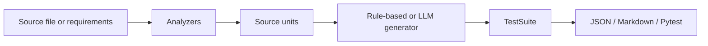

# Test Case Generation Agent

An autonomous agent that analyzes **Python source code** or **requirements documents** and produces structured, exportable test cases.

## Features

- **Code analysis** — AST-based extraction of functions, methods, signatures, and docstrings
- **Requirements parsing** — turns markdown/text bullet lists into testable requirement units
- **Rule-based generation** — deterministic happy-path, edge, boundary, and negative cases (no API key required)
- **Optional LLM mode** — richer cases via OpenAI when `OPENAI_API_KEY` is set
- **Multiple exporters** — JSON, Markdown, and pytest stub output
- **CLI** — `testcase-agent generate` and `testcase-agent analyze`

## Quick start

```bash
cd /agent
pip install -e ".[dev]"
testcase-agent generate examples/sample_module.py
testcase-agent generate examples/requirements.md --format json
testcase-agent analyze examples/sample_module.py
```

## CLI usage

```bash
# Markdown test plan (default)
testcase-agent generate path/to/module.py

# JSON output
testcase-agent generate path/to/module.py --format json -o tests/generated.json

# Pytest stubs
testcase-agent generate path/to/module.py --format pytest -o tests/test_generated.py

# LLM-backed generation (requires OPENAI_API_KEY and pip install -e ".[llm]")
testcase-agent generate path/to/module.py --mode llm
```

## Python API

```python
from testcase_agent import TestCaseGenerationAgent
from testcase_agent.exporters import export_suite

agent = TestCaseGenerationAgent(mode="rule")
suite = agent.generate_from_file("examples/sample_module.py")

print(f"Generated {len(suite.test_cases)} cases for {len(suite.units)} units")
markdown = export_suite(suite, "markdown")
```

## Architecture



| Component | Responsibility |
| --- | --- |
| `analyzers/` | Detect language and extract testable units |
| `generators/` | Produce `TestCase` objects from units |
| `exporters/` | Serialize suites to consumer formats |
| `agent.py` | Orchestrates the full pipeline |
| `cli.py` | Command-line interface |

## Test case schema

Each generated case includes:

- `id`, `title`, `description`
- `test_type` — unit, integration, edge, negative, boundary, security, performance
- `priority` — critical, high, medium, low
- `target` — function, method, or requirement under test
- `preconditions`, `steps`, `expected_result`
- optional `test_data` and `tags`

## Development

```bash
pip install -e ".[dev]"
pytest
```

## License

MIT
